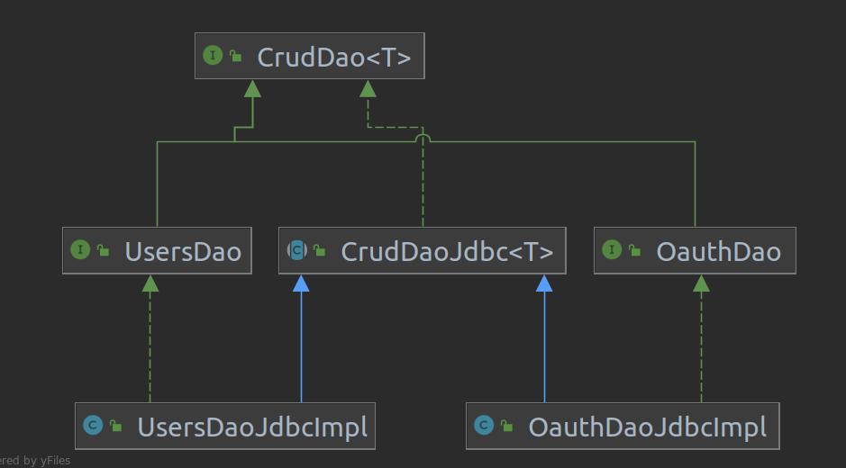
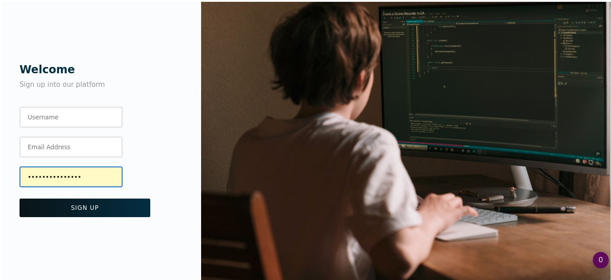

# Cloud

Что это ☁: облачное хранилище, где можно объединять юзеров (общие открытые файлы)

Зачем 🤷: имею несколько аккаунтов и всё время забываю, что где лежит. Хочу объединить пользователей в
одну экосистему

Технически 👷: регистрация на сервере, получение токена от Яндекс-Диска, сохранение токена в БД, распределение
полномочия (
admin or user). Каждый файл — всего лишь ссылка на документ в облачном сервисе

Для пользователя 👶: регистрируемся в моей системе, даём доступ к Яндекс Диску и становимся частью большого облака

Завершенность 🏁: Проект ещё в разработке, пока что готова авторизация, регистрация и всё, что связано с Яндекс-Диском. 
В дальнейшем можно добавить несколько облачных сервисов для полной завершённости

### Технологии

- JavaEE (servlets + jsp)
- JS + html/css
- Postgresql + JDBC
- Tomcat Server
- JUnit 5 + Mockito
- log4j2
- Maven


# Паттерны

### Dao

Сконструировал гибкую Dao-шку в пакете `dao`. Вроде, предельно всё понятно:




### Builder

Смотрим реализацию в `model.User`: 

И по простому используем в классе `web.servlet.signUp.SignUpServlet`:
```java
User user = new User.Builder()
                    .userName(userName)
                    .email(email)
                    .password(password)
                    .build();
```

# Web

### Авторизация

Первым делом нас встречает авторизация. (`web.servlet.DefaultServlet` 
перекидывает нас на страничку "/login"). 
Авторизация происходит через `javax.servlet.http.HttpSession`:
если ты есть в базе данных, перекидываем на "/home", иначе оставайся на странице или регистрируйся.

При авторизации за корректностью ввода данных следит JS 


### Регистрация

За регистрацию отвечает страница `/signUp`. Здесь за корреткность
ввода отвечает код из `webapp/JS/signUpCheck`: пароль должен быть от
7 символов и тд и тп (более подробно см. ).



Кидает на страничку с инструкцией, которую можно пропустить. (сейчас там
всего лишь кнопка skip). После чего предлагается дать мне доступ
к вашему Яндекс-Диску.

### Яндекс Диск

После успешной регистрации пользователя кидает на страничку, 
где он может дать доступ моему приложению. Как только пользователь разрешает доступ, Яндекс
выдаёт моему приложению токен, который я закидываю в базу данных (PSQL).

Более подробно см. 
